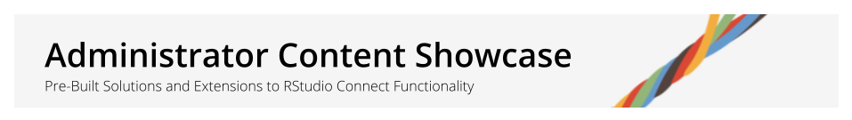

```{r include=FALSE}
library(connectwidgets)
library(dplyr)

all_content <- connect() %>% content() 
```

## Content Showcase for Admins {.tabset}

Extend RStudio Connect with pre-built content that leverages the Connect Server APIs.

-   Deploy reports and applications directly from this window
-   Access the code on GitHub to copy and customize it before deploying

### Audit Reports

Using the RStudio Connect Server API, administrators can create scheduled reports to track and manage the content on their servers. 

**Use the report templates to answer questions like...**

-   How do I produce a list of all the content we have published to RStudio Connect?
-   Which applications can be accessed by which people and which groups?
-   Which versions of R and Python are actually being used, and by which publishers?
-   How much unpublished content is on the server?
-   Which vanity URLs do we have in use across the server, and how do I list them out?

```{r echo=FALSE}
audits <- all_content %>%
  by_tag("Audit Reports")

audits %>% rsc_card()
```

### Pin Generators

**Pin Generators** are R Markdown reports that run on a schedule to create or update a pinned resource. These examples require an Admin API Key to pull complete data from the RStudio Connect server.

```{r}
all_content %>%
  by_tag("Pin Generators") %>%
  rsc_card()
```

#### About Pins

![pins-diagram.png]

As a **Publisher**, you may request access to any **Pins** you need for generating reports relevant to your team's KPIs. For more complex auditing tasks, you may want to create your own Pins and Pin Generators that run on a schedule. Decomposing the steps of an audit report into Pins can be beneficial when components need to be reused across multiple reports, or to keep overall code complexity in check. The drawback is decomposition can increase the complexity required to schedule report execution to occur in the correct sequence.


### Content Usage

RStudio Connects provides access logs for most types of assets that can be published to the server. They can be accessed via the RStudio Connect Server API. Look-up information, such as user and application metadata is also available through specific endpoints of the same RStudio Connect Server API. The API contains data to help answer questions like:

-   What content is most visited?
-   Who is visiting my content?
-   What reports are most common?
-   Has viewership increased over time?
-   Did my CEO actually visit this app?

```{r echo=FALSE}
all_content %>%
  by_tag("Content Usage") %>%
  rsc_card()
```

More information about what is possible to do with the RStudio Connect Server API, how to access and how to interact with it can be found in the official reference guide here: [RStudio Connect API Reference](https://docs.rstudio.com/connect/api/#tag--Instrumentation).

* Additional References: RStudio::Solutions [Guide to Usage Tracking](https://solutions.rstudio.com/data-science-admin/tracking/#usage-tracking)

### User Management {.tabset}

Within RStudio Connect, every user account is configured with a "role" that controls their default capabilities on the system. Their "permissions" to access and manage content which has been published to the RStudio Connect server may vary, depending on what has been granted to their account by the content owner (the account which published the content to the server).

**Accounts can be either created / pre-provisioned or auto-registered. Details and capabilities differ by authentication provider.**

```{r echo=FALSE}
all_content %>%
  by_tag("User Management") %>%
  rsc_card()
```
